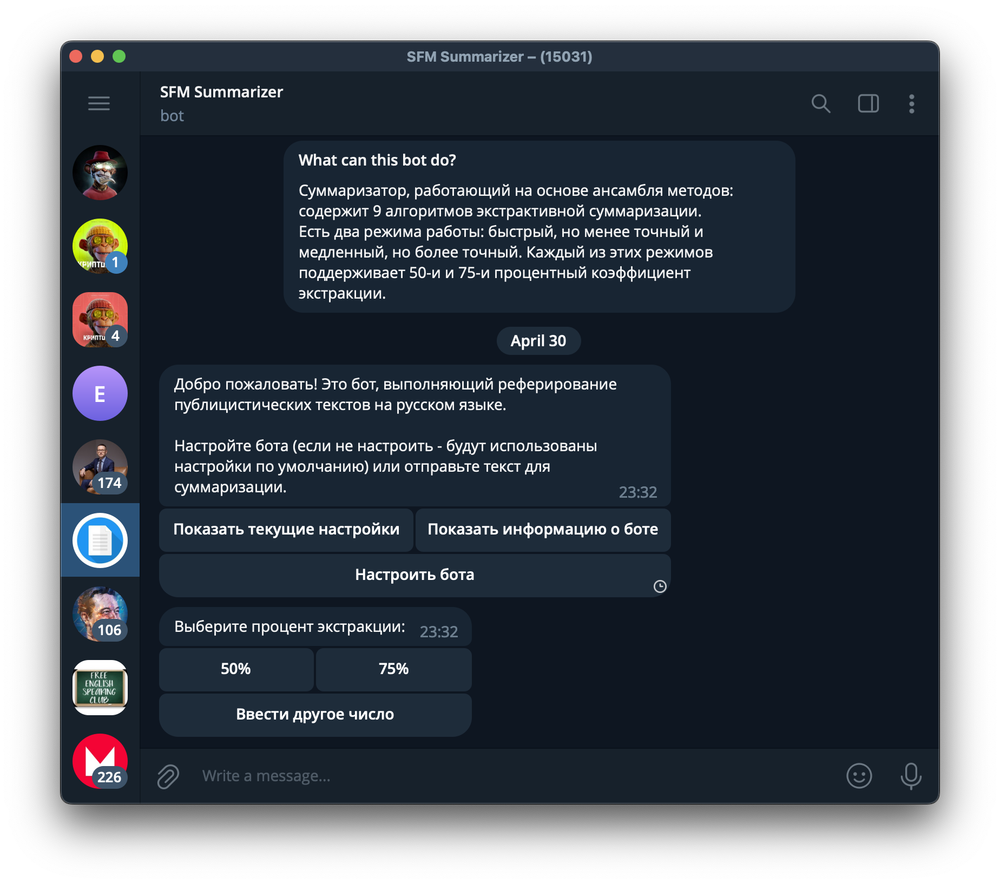

<br>
<br>

```
                           .oooooo..o oooooooooooo ooo        ooooo 
                          d8P'    `Y8 `888'     `8 `88.       .888' 
                          Y88bo.       888          888b     d'888  
                           `"Y8888o.   888oooo8     8 Y88. .P  888  
                               `"Y88b  888    "     8  `888'   888  
                          oo     .d8P  888          8    Y     888  
                          8""88888P'  o888o        o8o        o888o   
```

<h4 style="text-align: center;">Search For Meaning (SFM) –– is a summarizer for Russian language. </h4>

The SFM based on an ensemble of the next extractive summarization algorithms:
1. Importance Calculation, <br>
2. TextRank, <br>
3. LexRank, <br>
4. Latent Semantic Analysis, <br>
5. Luhn Algorithm, <br>
6. The Minto Pyramid (Lead-based),<br>
7. Features Calculation, <br>
8. Word2Vec, <br>
9. RuBERT. <br>
10. 
This project was deployed with help a *Telegram bot*.

## Installation

1. Clone the repository. <br>
	```git clone https://github.com/TONYFIERRO/sfm_summarizer.git``` <br>

	If you want to use the SFM with Telegram bot go to the step 3 otherwise go to the step 2. <br>
2. Manually install all dependencies that wrote in *Dependencies* point below. Then just run *starter.py* and that's all.

3. Set the telegram token in *bot_config.py*. <br>

4. Build a docker image. It takes about 3 minutes. <br>
	```docker build . -t sfm``` <br>
	
5. Run the docker image as a container. <br>
	```docker run sfm``` <br>
	


## Dependencies

You can install all dependencies manually in the terminal:

```
python -m spacy download ru_core_news_lg
python -m nltk.downloader punkt
pip install gensim==4.3.1 networkx==3.0 nlp_rake==0.0.2 numpy==1.24.2 pyTelegramBotAPI==4.10.0 rusenttokenize==0.0.5 spacy==3.5.1 sumy==0.11.0 torch==2.0.0 transformers==4.27.3 yake==0.4.8 nltk==3.8.1 emoji==2.2.0
```

Or use the installation option *with Telegram bot* that uses *Docker-containerization*.

## Demonstration

<h4 style="text-align: center;">Changing the settings (part I): the bot requires a choice of the extraction coefficient.</h4>


---
<h4 style="text-align: center;">Changing the settings (part II): the bot requires a mode selection.</h4>


---
<h4 style="text-align: center;">The bot can show the current settings.</h4>


---
<h4 style="text-align: center;">Just send a text to summarize it.</h4>


## Disadvantages

* When text contains two or more sentences that relate directly with each other, the SFM may ignore some of them and this situation causes partial sense losing.

## Licence

The MIT Licence. More detailed in LICENCE file.

## Contact

Author: Shamil Zaripov <br>
Email: mail@tonyfierro.com <br>
Telegram: @tonyfierro <br>
